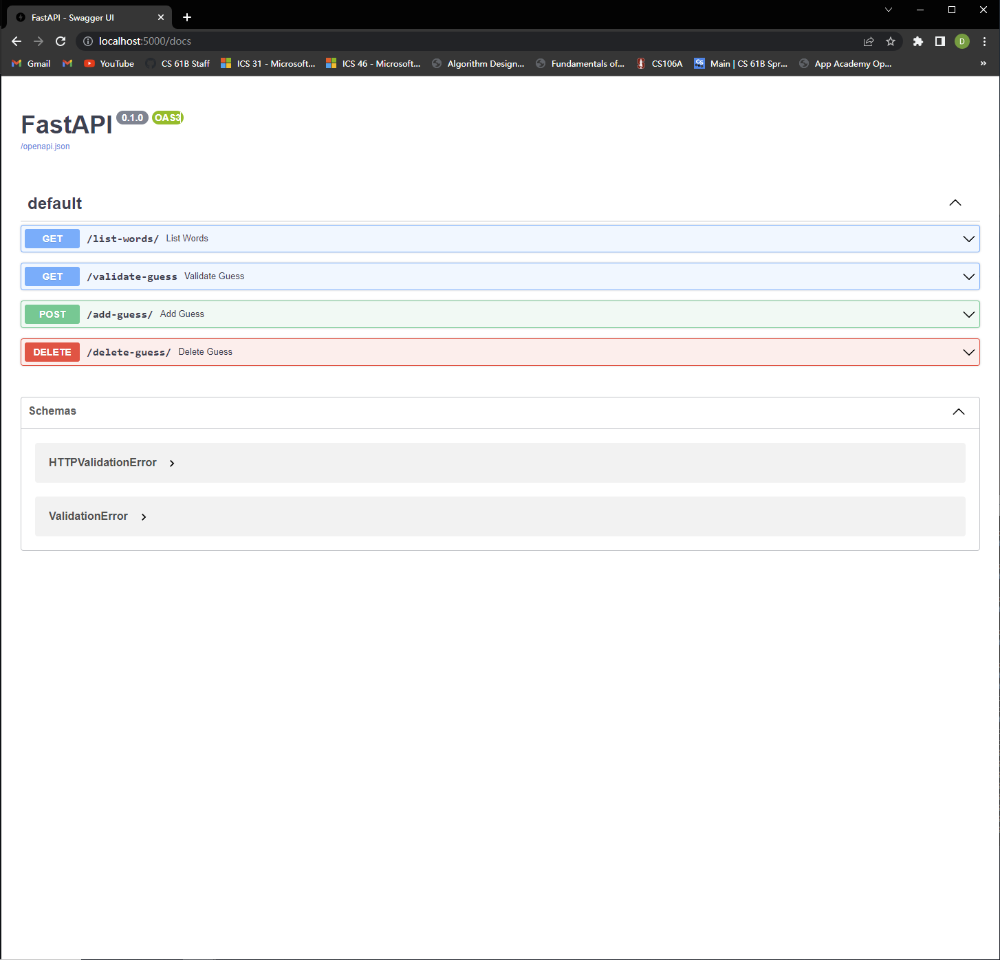
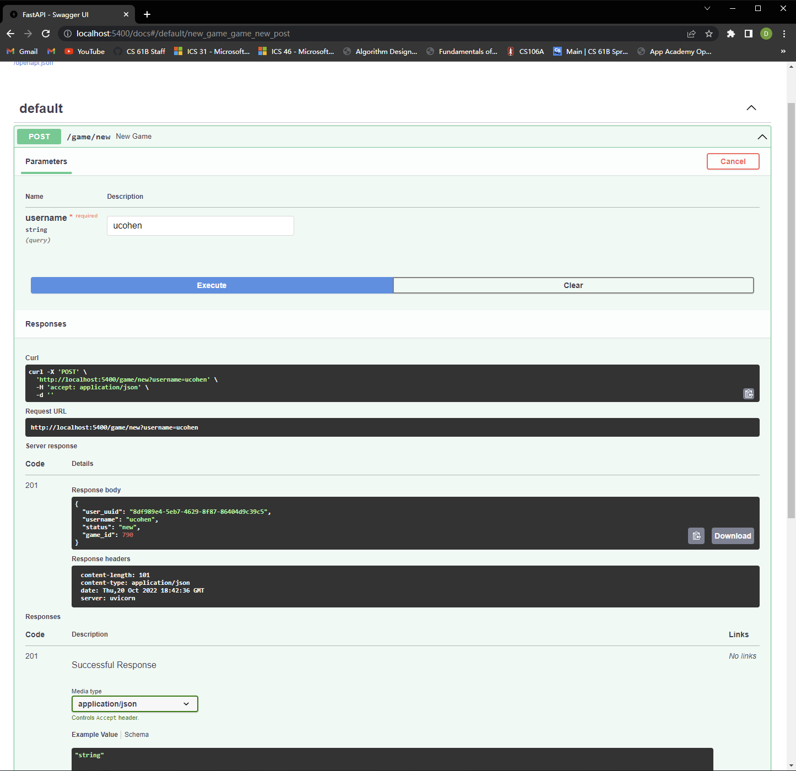

# wordle-api(back-end)
# CPSC 449 - Wordle-Clone Api

Team Members:

Ryan Broguiere: ryanbroguiere123@csu.fullerton.edu  
Andy Cao: dongyicao123@csu.fullerton.edu  
Gavin Gray: graygavin11@csu.fullerton.edu

## Project Description
Created Project 3 with a python file that shards the stats database into three databases.
This project also implements traefik as a reverse-proxy and uses foreman to create three instances of the trackApi.

## Project Requirements
This project will run using Tuffix 2020 using Python 3.8.10 and will be implemented using fastapi and sqlite3.
require user install fastapi, ruby-foreman, sqlite3, and httpie, faker,

## Run the Program
### 1. install pip package installer and other tools:
    sudo apt update
    sudo apt install --yes python3-pip ruby-foreman httpie sqlite3 redis python3-hiredis

### 2. Install FastAPI:
    python3 -m pip install 'fastapi[all]'

### 3. Project => Then run the command:
    ### To initialize the database, type:
        cd into the api folder directory wordle-project3/api
        ./bin/init.sh
        python3 shard.py in bin file
    ### To start the uvicorn servers, type:
        foreman start -m api=1,answersApi=1,trackApi=3
    ### To start the Traefik files type:
        ./traefik --configFile=traefik.toml

### 4. Project => Run the command:
      cd into the wordle-clone/api/bin
  ### Get sql data and transport to redis:
      redis-server
      python3 materialize.py
  ### crontab initialization for every 10 minutes:
      crontab -e
  ### copy this into the terminal:
      */10 * * * * cd /home/student/wordle-clone/api/bin/ && /usr/bin/python3 materialize.py >> check.log
  ### This will show the above command is working:
      crontab -l

## Previews

### User Guessing Management Microservices

### Answers Management Microservices

### User Stats Microservices

### Update Game Microservices

### Wordle back-end Services

### Login and Create User

### User Guess and game answers

### Current User Stats After Game

